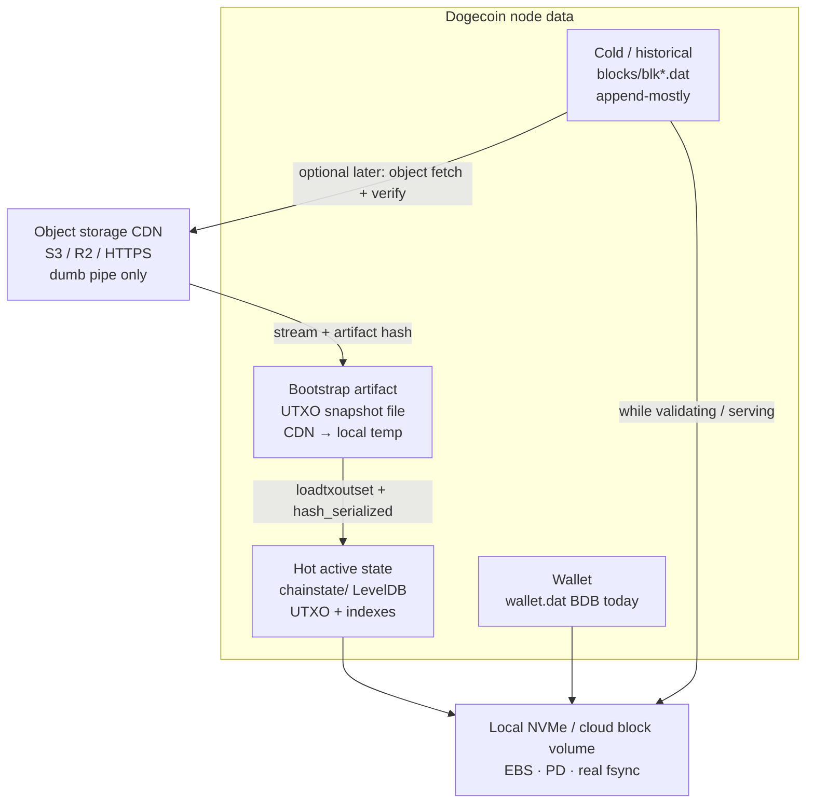
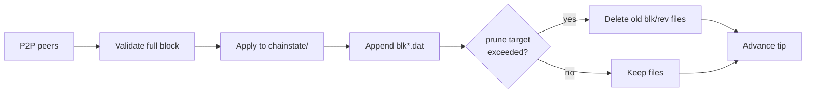

# Tiered storage & fast sync — Dogecoin Core Pro (1.14.102)

**Status:** engineering AssumeUTXO A–D3 **done**; product P1 **~90%** (CDN + WinHTTP + **P1.7 FastSyncDialog shipped** in `dogecoin-1.14.102-win64` zip/setup); mesh **M1 live**, **M2** next  
**Date:** 2026-08-09  
**Audience:** implementers + release operators  

This document is the **authoritative product architecture** for:

1. Making first-run **usable without a week of full IBD**  
2. Keeping disk **bounded** (prune-as-you-go)  
3. Using **cloud only as a dumb CDN** (hash, fail closed) — never as a live LevelDB mount  
4. Leaving room for **RocksDB-class** hot engines later (ops win, not the main space win)

**Risk language (honest):** we do **not** claim zero corruption risk. We **detect** bad artifacts (hashes), **refuse** them, and **recover** (fallback IBD / re-fetch / reindex). Disks lie; networks drop; bitrot happens.

**Plain-language user guide (HTML):** `html/docs/pages/fast-sync.html`  
**Architecture diagrams (Eraser):** `html/docs/pages/diagrams.html` · assets in `html/docs/assets/diagrams/` · sources `-FlowDiagramLatest/`  
**Multi-operator mesh:** `html/docs/pages/multi-operator-mesh.html`  
**Root README** also carries a short Fast Sync section for GitHub readers.

### Fast Sync in one page (same story as the HTML guide)

| | Normal IBD | Fast Sync |
|--|------------|-----------|
| Download | Many blocks from peers | ~11 GB snapshot over HTTPS CDN + later peers |
| Wallet tip usable | Late | Sooner, after load/activate at attested H |
| Trust | You built UTXOs yourself | File SHA-256 + `mapAssumeutxo` + **background P2P prove** |
| Cloud role | None | Dumb file host only |

```text
CDN file ──file SHA-256──► load UTXOs at H ──activate──► wallet near tip
                                 │
                                 └── background P2P 0→H ──re-prove hash_serialized
                                 └── P2P keeps tip moving past H
```

**Do not** start multi‑GB Fast Sync on a datadir already mid classic IBD. Prefer empty/new datadir.

---

## 0. Naming: do not confuse two “Phase A”s

| Name | What it is | Status |
|------|------------|--------|
| **Engineering AssumeUTXO A–D3** | Dual chainstate, dump/load/activate, background prove, `mapAssumeutxo` hooks, prune guard, smokes | **Done** — see `doc/assumeutxo-dogecoin-1.14.md` |
| **Product roadmap P1–P4** (this doc) | Trust anchors + CDN snapshot + GUI fast sync + default prune + optional cold blocks + storage engine | **Open** |

Gemini/chat sometimes call “Phase A: Trust Anchors.” That maps to **Product P1** below, **not** engineering Phase A (already shipped).

---

## 1. What is already in the tree

| Capability | Location / notes |
|------------|------------------|
| Dual chainstate (active + background) | `src/node/chainstate.*` |
| Snapshot dump / load | `dumptxoutset` / `loadtxoutset`, `src/node/utxo_snapshot.*` |
| Activate tip (dev-gated) | `activatesnapshot`, `-assumeutxodev` |
| Background prove to `hash_serialized` | fail-closed on mismatch |
| Session restore | `assumeutxo.dat` |
| Attestation **structure** | `AssumeutxoData` + `mapAssumeutxo` in `chainparams` |
| Mainnet attestation | **`mapAssumeutxo[6324519]`** from gpednode dump (live) |
| GPE CDN | `https://sync.doge.gopastearth.com/latest.json` + multi‑GB `.dat` |
| Stream-and-hash + RPC | `src/node/snapshot_fetch.*`, `fetchassumeutxo`, `fetchassumeutxomanifest` |
| Windows HTTPS | **WinHTTP/Schannel** path; smoke-proven (`scripts/smoke-winhttp-https.ps1` vs GPE CDN) |
| Auto prune-as-you-go | Stock Core: `-prune=<MiB>` (not invented by Pro) |
| Prune blocked during bg proof | D3 |

**What is missing for users:**

- Product default **prune** for non-archival installs (P2 polish)  
- Optional **cold `blk` object CDN** (later / mesh M4)  
- Multi-operator mesh **M2+** (multi-URL failover code; second independent mirror)

**Mesh design (plain language + stages):** `html/docs/pages/multi-operator-mesh.html`

---

## 1b. Multi-operator mesh (how speed scales without new consensus)

**Problem:** one CDN region/org is a bottleneck (latency, capacity, outages).  
**Solution:** many operators host the **same hash-checked** artifacts; clients failover across `urls[]`.

| Role | Job |
|------|-----|
| Dump / settlement node | `dumptxoutset` at H; publish digests |
| CDN / mirror | Static HTTPS `latest.json` + `.dat` (and later optional blk objects) |
| Client | Stream-hash; require file SHA-256 + `mapAssumeutxo`; background prove |

**Why faster:** geographic mirrors, more aggregate bandwidth, failover, fresher multi-dumper schedules (less tip catch-up after H).  
**Why still safe:** wrong mirror fails SHA-256; wrong UTXO fails attestation/prove. More operators ≠ automatic trust.

**Maturity:** M1 = first public operator (GPE, live) → M2 multi-URL client failover → M3 multi-dumper → M4 cold blk CDN (P3).

---

## 2. Trust model (two different hashes)

Gemini’s sketch sometimes confuses **file SHA-256** with **`hash_serialized`**. Both matter; they are **not** the same.

| Hash | What it covers | Who checks it |
|------|----------------|---------------|
| **`hash_serialized`** | Canonical hash of the **UTXO set** at height H (same idea as `gettxoutsetinfo`) | Already: `AssumeutxoData` / activate gate / background prove |
| **Artifact digest** (e.g. SHA-256 of the snapshot **file** bytes) | CDN blob integrity in transit | **Product P1** stream-and-hash downloader |
| **Block hashes / header chain** | Individual blocks once applied | Existing consensus |

```text
CDN object (multi-GB)
    │  stream to temp + artifact SHA-256
    ▼
artifact digest matches manifest?  ──no──► delete temp, fail closed / full IBD
    │ yes
    ▼
loadtxoutset → coins DB
    │
    ▼
hash_serialized of coins matches mapAssumeutxo[H]?  ──no──► fail closed
    │ yes
    ▼
activate tip (no -assumeutxodev required for attested H)
    │
    ▼
background ConnectBlock genesis→H → re-prove hash_serialized
```

**Fail closed** at every trust step. Never “best effort soft trust” for real funds.

### `AssumeutxoData` (already in code)

```cpp
// chainparams.h — already present
struct AssumeutxoData {
    int height;
    uint256 hash_serialized;  // UTXO set hash, NOT file SHA-256
};
// mapAssumeutxo[height] = AssumeutxoData(height, hash);
```

**Do not** redefine this as “SHA-256 of the snapshot file.”  
Optional **manifest** (JSON or chainparams extension) may add:

- `base_blockhash`  
- `n_coins` (sanity)  
- `artifact_sha256`  
- `urls[]` (HTTPS CDN)  
- `size_bytes`

---

## 3. Storage tiers (enterprise reality)



| Tier | May live on consumer cloud sync (Drive/Dropbox)? | May live on S3 as objects? | Must be local / block storage? |
|------|--------------------------------------------------|----------------------------|--------------------------------|
| Live `chainstate/` | **No** | **No** | **Yes** |
| Live wallet | **No** (backup copies OK) | No as live DB | **Yes** |
| Immutable snapshot / archive objects | N/A | **Yes** (after hash verify write local) | Working copy local |
| `blk*.dat` while validating | Risky on sync folders | Fetch as objects OK | Working set local |

**Never:** mount FUSE/S3/SMB as the datadir and expect LevelDB to be safe.

---

## 4. Product roadmap P1–P4

### P1 — Trust anchors + stream-and-hash + Fast Sync UI  ← **~90% shipped**

**Goal:** attested height H; download multi‑GB snapshot without loading whole file into RAM; fail closed; wallet tip usable; background prove continues.

| Work item | Notes |
|-----------|--------|
| P1.1 Publish attestation | **Done (mainnet H=6324519):** `mapAssumeutxo` filled; more heights as dumps publish |
| P1.2 Artifact hosting | **Done (GPE):** `https://sync.doge.gopastearth.com/` ~11 GB object |
| P1.3 Manifest | **Done:** `ParseSnapshotArtifactManifest` / `ResolveSnapshotFromManifest`; `latest.json`; RPC `fetchassumeutxomanifest` |
| P1.4 Stream-and-hash downloader | **Done:** `src/node/snapshot_fetch.*` + `fetchassumeutxo`. **Windows PE:** WinHTTP/Schannel. **Linux:** libevent (HTTPS may need SSL-enabled libevent or local path) |
| P1.5 Wire to load path | **Done:** PE E2E local path + WinHTTP HTTPS smoke vs GPE (`scripts/smoke-fetchassumeutxo-e2e.ps1`, `smoke-winhttp-https.ps1`) |
| P1.6 Intro Fast path | **Done:** Intro Fast vs Archive; SoftSet `-prune=5500` + `fPreferFastSync`; Options snapshot fields |
| P1.6 Fail closed | **Done:** mismatch → delete temp, log critical, refuse activate / offer IBD |
| P1.6b Package | **Done:** `release/dogecoin-1.14.102-win64.zip` + `-setup.exe` (+ rebuilds under `release/latest/` when shipping fixes) |
| P1.7 GUI modal | **Done:** `qt/fastsyncdialog.*` — Settings → Fast Sync from CDN; first-run offer; progress + abort; load+activate |
| P1.8 Docs / security FAQ | **Done (living):** HTML Fast Sync + threat model + mesh + Eraser diagrams; keep in sync with code |

**Still open under the P1 umbrella (not blocking package use):**

- Multi-URL manifest `urls[]` + client failover → **mesh M2**  
- Additional independent mirrors / dumpers  
- Linux HTTPS parity polish  
- More attested heights as dumps rotate  

**C++ surface:**

| Area | Files / APIs |
|------|----------------|
| Anchors | `chainparams` `mapAssumeutxo` (mainnet **6324519** filled) |
| Downloader | `src/node/snapshot_fetch.h/.cpp` (stream SHA-256, WinHTTP/libevent, fail closed) |
| RPC | `fetchassumeutxo`, `fetchassumeutxomanifest`, `loadtxoutset`, `activatesnapshot`, `listassumeutxo` |
| GUI | `qt/fastsyncdialog.*`, Settings menu, Intro first-run offer |

**Exit criteria:**

- [x] Regtest PE smokes without relying on mainnet map (dump/load/activate/collapse)  
- [x] Mainnet entry **6324519** documented and in map  
- [x] Wrong artifact digest never activates  
- [x] Wrong coins hash never activates  
- [x] GUI can choose Fast vs Standard / Fast Sync dialog  
- [ ] Mesh M2 multi-URL failover (tracked under multi-operator mesh, not blocking P1 package)

---

### P2 — Default prune-as-you-go (product)

**Goal:** normal installs never grow 100 GB+ of dead history by surprise.

| Work item | Notes |
|-----------|--------|
| P2.1 Document stock behavior | `-prune=<MiB>` already auto-prunes mid-IBD |
| P2.2 Installer / first-run default | **Partial:** Intro Fast path SoftSets `-prune=5500` + Options `bPrune` when `fPreferFastSync` (2026-08-09) |
| P2.3 Archival checkbox | Intro “Full archive” + Options uncheck prune |
| P2.4 Interaction with AssumeUTXO | Keep D3 rules; after prove, prune remaining policy documented |

**Exit criteria:** new user path defaults to bounded disk; archival is opt-in.

---

### P3 — Optional cold block object CDN

**Goal:** fetch historical `blk` objects over HTTPS when peers are slow or for reindex assist — still verify, still write local.

| Work item | Notes |
|-----------|--------|
| P3.1 Content addressing | Object key ↔ file hash / range of heights |
| P3.2 Stream to disk + verify | Same as P1: no “trust the cloud disk” |
| P3.3 Integrate with historical getdata | Prefer peers; CDN as secondary source |
| P3.4 No FUSE | Explicit non-goal |

**Depends on:** stable local block store semantics; nice-to-have after P1–P2.

---

### P4 — Hot storage engine (RocksDB / etc.)

**Goal:** better chainstate **operations** (write amp, stalls, optional compression).  
**Space:** small win on `chainstate/` only — **not** a substitute for prune.

| Work item | Notes |
|-----------|--------|
| P4.1 `dbwrapper` abstraction audit | |
| P4.2 RocksDB (or libmdbx) backend | Optional build / runtime |
| P4.3 Migration / reindex path | |
| P4.4 AssumeUTXO hash stability | `hash_serialized` must remain well-defined |

**Orthogonal** to dual chainstate views and to P1 CDN.

---

## 5. End-to-end user flows

### 5.1 Fast Sync (P1 target)

```mermaid
sequenceDiagram
  participant U as User
  participant GUI as dogecoin-qt
  participant CDN as HTTPS CDN
  participant Node as Validation
  participant Disk as Local NVMe

  U->>GUI: First boot → Fast Sync
  GUI->>CDN: GET snapshot (stream)
  CDN-->>Disk: temp.dat chunks
  Note over GUI,Disk: Hash while streaming
  alt artifact digest mismatch
    GUI->>Disk: delete temp
    GUI->>U: Fail closed → offer Standard IBD
  else digest OK
    GUI->>Node: loadtxoutset(temp)
    Node->>Node: hash_serialized vs mapAssumeutxo
    alt coins hash mismatch
      Node->>U: Fail closed
    else OK
      Node->>Node: activate tip at H
      Node->>Node: background prove genesis→H
      Node->>Disk: chainstate/ + chainstate_snapshot/
      U->>U: Wallet usable; history proves later
    end
  end
```

### 5.2 Standard Sync + prune (today + P2)



### 5.3 What we will not build

- Live datadir on Google Drive / Dropbox / OneDrive  
- LevelDB on S3-FUSE  
- “Zero corruption” marketing  
- Treating CDN as consensus authority without hashes  
- Soft-fork UTXO root (different project)  
- Utreexo as near-term Core default (research only)

---

## 6. Operator runbook (attestation)

Also see multi-operator checklist: `html/docs/pages/multi-operator-mesh.html`.

When a community/operator is ready to publish height H:

```bash
# On a fully synced archival (or sufficiently complete) node at tip >= H
dogecoin-cli dumptxoutset /path/to/utxo-H.dat
# Note JSON: hash_serialized, base height/hash, assumeutxo_snippet

# Compute artifact digest for CDN manifest
sha256sum /path/to/utxo-H.dat

# Host file on R2/S3 (immutable object)
# PR: mapAssumeutxo[H] = AssumeutxoData(H, uint256S("hash_serialized..."));
# Ship release notes + manifest JSON next to binary docs
```

**Mainnet caution:** do not enable non-dev activation for a height until multiple independent dumps agree on `hash_serialized`.

---

## 7. Success metrics

| Metric | Target (honest) |
|--------|------------------|
| Time to wallet-usable tip (Fast Sync, home broadband) | Order of **tens of minutes**, not days (depends on snapshot size + disk) |
| Disk for “wallet node” after prune default | **Single-digit to low tens of GB**, not unbounded archive |
| Wrong CDN blob | **Never** activates tip |
| Wrong UTXO set | **Never** silent accept; fail closed |
| Background prove | Completes without user action; progress visible |

---

## 8. Doc & diagram index

| Artifact | Role |
|----------|------|
| **This file** | Product architecture P1–P4 |
| `doc/assumeutxo-dogecoin-1.14.md` | Engineering A–D3 + product follow-ons |
| `html/docs/pages/fast-sync.html` | Plain-language Fast Sync guide |
| `html/docs/pages/multi-operator-mesh.html` | Mesh M0–M4 |
| `html/docs/pages/fast-sync-threat-model.html` | CDN threat model vs GPE |
| `html/docs/pages/assumeutxo.html` | Living AssumeUTXO status |
| `html/docs/pages/storage-stack.html` | Engines + tiered storage |
| `html/docs/pages/diagrams.html` | **Canonical Eraser diagrams** (master / sequence / dual chainstate) |
| `html/docs/assets/diagrams/` | Published PNG/SVG assets |
| `-FlowDiagramLatest/` | Source Eraser exports + `updatedmermaid.txt` |
| `html/docs/pages/roadmap.html` | Phase checklist |
| `DOGECOIN_CHANGELOG.md` | Heavy changelog |

---

## 9. Immediate next engineering (post–P1 package)

P1 core path is **shipped** (~90%). Remaining work:

1. ~~Stream-and-hash HTTPS downloader + manifest + fail closed~~  
2. ~~GUI Fast Sync dialog + first-run offer~~  
3. ~~Mainnet `mapAssumeutxo[6324519]` + GPE CDN hosting~~  
4. **Mesh M2:** multi-URL `urls[]` + client failover; second independent mirror  
5. **More dumps / heights** as operators schedule; keep map + manifests in sync  
6. **Product P2:** default prune for wallet-node installs (partial SoftSet already)  
7. **P3/P4** as capacity allows  

Cloud remains a **pipe**. Math remains the **judge**. Local block storage remains the **hot path**.
